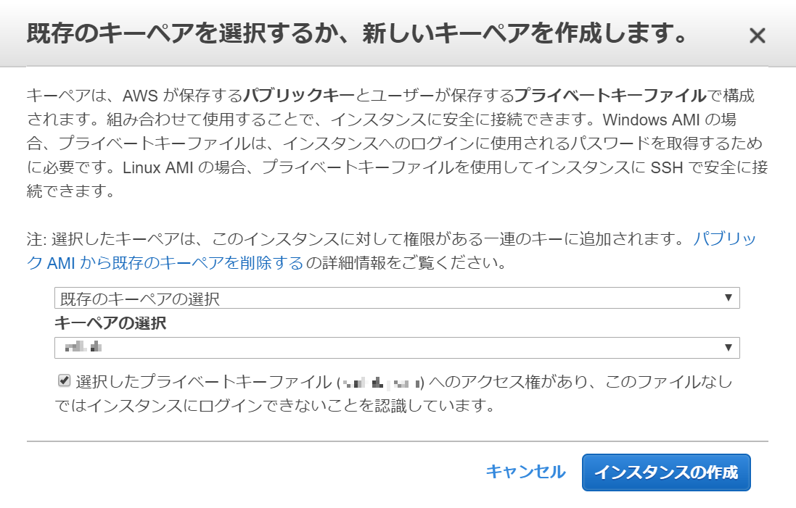
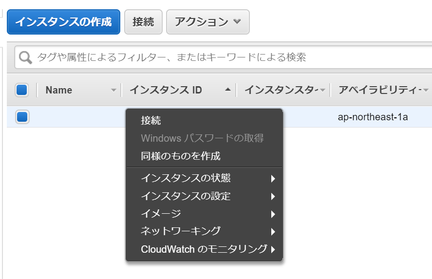
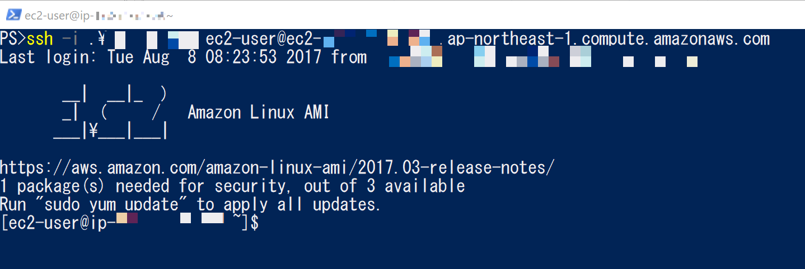

# 🔰PowershellでWin32-OpenSSHを利用してSSH接続をする

## 🔰Win32-OpenSSH公式サイト

- [github -Win32-OpenSSH](https://github.com/PowerShell/Win32-OpenSSH)

## 🔰概要

PowershellでSSH接続は標準機能でサポートしていない訳ですが。

マイクロソフトがリリースしているWin32-OpenSSHを利用するとPowershellでSSH接続が出来るようになるので試してみました。

## 🔰作業環境

- Windows10
- PSVersion 5.1.15063.483

## 🔰Win32-OpenSSHのインストール

- [Install Win32 OpenSSH](https://github.com/PowerShell/Win32-OpenSSH/wiki/Install-Win32-OpenSSH)
- [chocolatey - Win32 OpenSSH](https://chocolatey.org/packages/openssh)

公式サイトのインストール手順に沿ってインストール。

もしくはchocolateyにWin32 OpenSSHのパッケージがあるのでお好きな方法でインストールして下さい。

## 🔰SSH接続してみる

### 🔰接続先としてAWS EC2でLinuxインスタンスを立ててみる

SSHの接続先としてAWSで適当なLinuxインスタンスを立ち上げてテストしてみる。

AWSコンソールのEC2からインスタンスの作成

今回はAmazonLinuxを選択

セキュリティグループはSSHが接続できる設定にする

SSH接続に利用するpemファイルを指定する

EC2インスタンスが立ち上がるのを確認

### 🔰PowershellからSSHで接続

インスタンスを立てる時に指定したpemファイルでSSH接続を行う。

なお接続方法についてはAWSのLinuxインスタンスへの接続等に記載があります。

もしくはEC2のコンソールでインスタンスを選択してから接続ボタン or 右クリック -> 接続　で表示される情報を参照。

- [Linuxインスタンスへの接続](https://docs.aws.amazon.com/ja_jp/AWSEC2/latest/UserGuide/AccessingInstances.html?icmpid=docs_ec2_console)

右クリック -> 接続でインスタンスへの接続情報が表示される。

Powershellでsshコマンドの実行

あっさりつながりました。

## 🔰総評

普段Powershellを利用して作業している時に、さっくりSSHで接続できるのは便利かもしれない。

あとローカルPCのPoewrshellスクリプト内でsshでリモートコマンドを実行するなんて使い方もいいのかもしれない。
